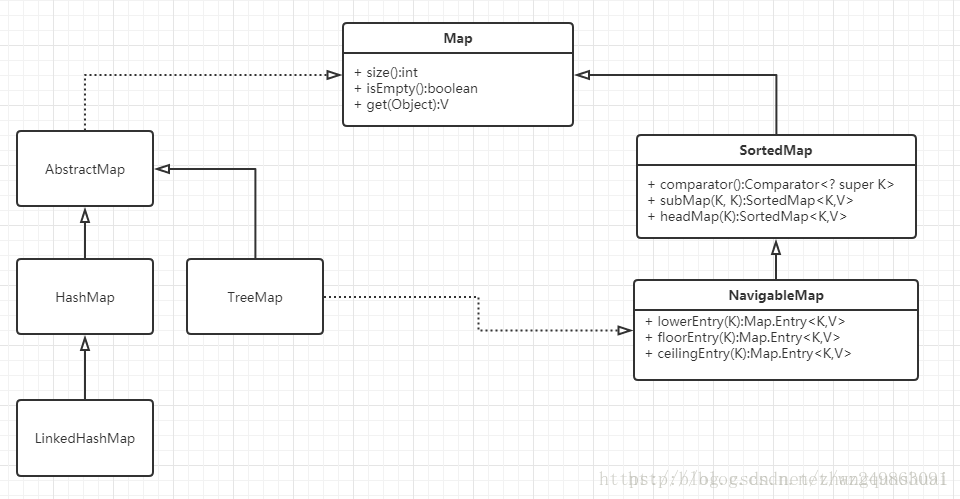

## Java容器

学习**[Java 容器常见面试题/知识点总结](https://snailclimb.gitee.io/javaguide/#/docs/java/collection/Java集合框架常见面试题)** 过程中自己的总结。

下面分为List，Queue，Set，Map四个部分总结。

### List

- ArrayList
- LinkedList

#### ArrayList和LinkedList的区别

1. **线程安全：** `ArrayList` 和 `LinkedList` 都不保证线程安全。
2. **底层数据结构：** `Arraylist` 底层使用的是 **`Object` 数组**；`LinkedList` 底层使用的是 **双向链表** 数据结构。
3. **插入删除：**`Arraylist` 插入删除受元素位置影响，末尾O(1)，中间要移动其余元素。`LinkedList`删除O(1)，插入指定位置O(n)。
4. **快速随机访问**：通过元素下标访问， `Arraylist` 支持，`LinkedList`不支持。
5. **内存空间占用**： ArrayList 的空间浪费主要体现在 list 列表的结尾会预留一定的容量空间，而 LinkedList 的空间花费则体现在它的每一个元素都需要消耗比 ArrayList 更多的空间。

### Set

- `HashSet`（无序，唯一）: 基于 `HashMap` 实现的，底层采用 `HashMap` 来保存元素。
- `LinkedHashSet`（有序，唯一）：`HashSet` 的子类，并且其内部是通过 `LinkedHashMap` 来实现的。
- `TreeSet`（有序，唯一）： 红黑树(自平衡的排序二叉树)。

#### Comparable和Comparator

- `comparable` 接口实际上是出自`java.lang`包 它有一个 `compareTo(Object obj)`方法用来排序
- `comparator`接口实际上是出自 java.util 包它有一个`compare(Object obj1, Object obj2)`方法用来排序

#### Map

- HashMap
- TreeMap
- HashTable

|                                | HashMap                                                      | Hashtable                              |
| ------------------------------ | ------------------------------------------------------------ | -------------------------------------- |
| 线程安全                       | N                                                            | Y(方法synchronized修饰)                |
| 效率                           | 较高                                                         | 较低                                   |
| 空键和值                       | null键只能有一个，null值可以多个                             | 不允许                                 |
| 初始容量大小和每次扩充容量大小 | 默认16，每次扩容为2倍。给定大小，扩充为2^n大小               | 默认初始大小11，每次扩充变为原来的2n+1 |
| 底层数据结构                   | Java8 以后的 `HashMap` 在解决哈希冲突时有了较大的变化，当链表长度大于阈值（默认为 8）（将链表转换成红黑树前会判断，如果当前数组的长度小于 64，那么会选择先进行数组扩容，而不是转换为红黑树）时，将链表转化为红黑树，以减少搜索时间。 |                                        |

**相比于`HashMap`来说 `TreeMap` 主要多了对集合中的元素根据键排序的能力以及对集合内元素的搜索的能力。**

==省略了原文很多关于底层的问题==

#### HashMap遍历

[HashMap 的 7 种遍历方式与性能分析！](https://mp.weixin.qq.com/s/Zz6mofCtmYpABDL1ap04ow)

